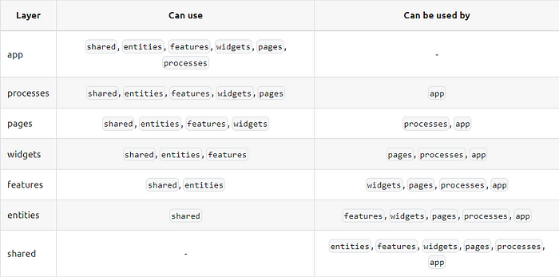

## Business Domains

- Auth
- Users
- Departments
- Languages
- Skills
- CVs
- Projects

`app` and `shared` contain "segments" directly. Everything else i.e. `features`, `pages` and `widgets` etc.
contain domain subdirs which in turn contain "segments" like `ui`, `services`, `http` etc.

1. Layers
   The trick with layers is that modules on one layer can only know about and import from modules from the layers strictly below.

2. Slices (Domains)
   Partition the code by business domain.
   Slices (domains) cannot use other slices (domains) on the same layer, and that helps with high cohesion and low coupling (questionable).

3. Segments
   Slices (domains), as well as layers App and Shared, consist of segments, and segments
   group your code by its purpose.

   Segment names:
   - `ui` UI components
   - `services` hooks that interact with the network to CRUD data
   - `hooks` hooks
   - `model` data models
   - `utils` library code that other modules on this slice (domain) need
   - `lib` external libs setup
   - `http` HTTP methods
   - `config` configuration files
   - etc.
